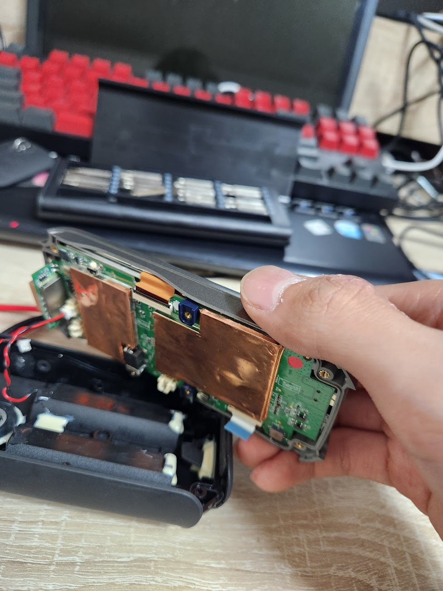
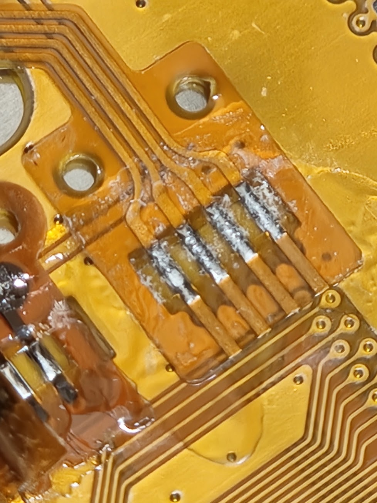
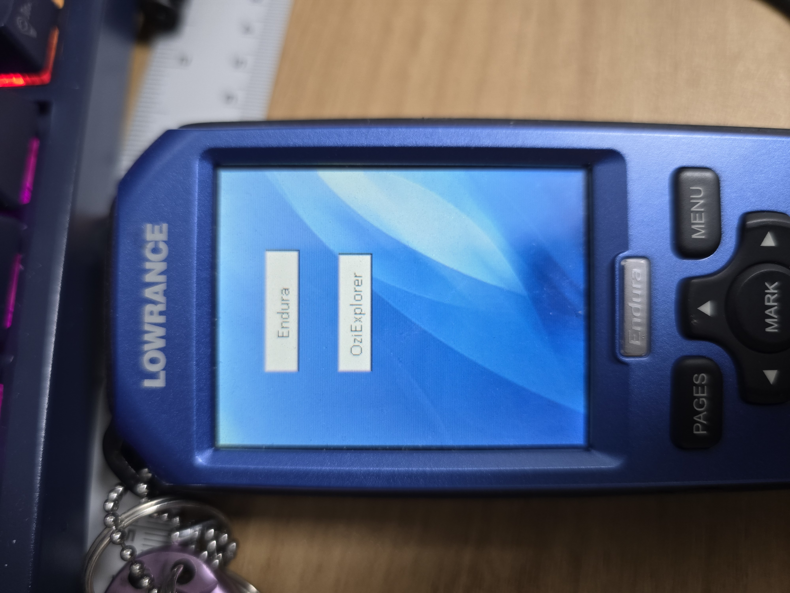
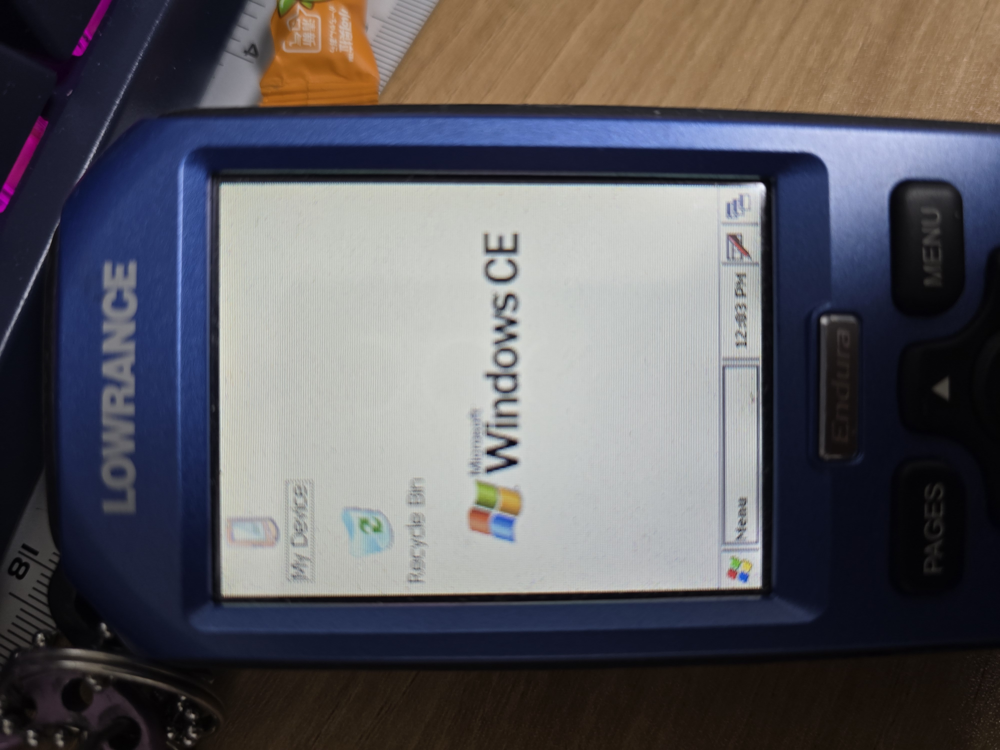
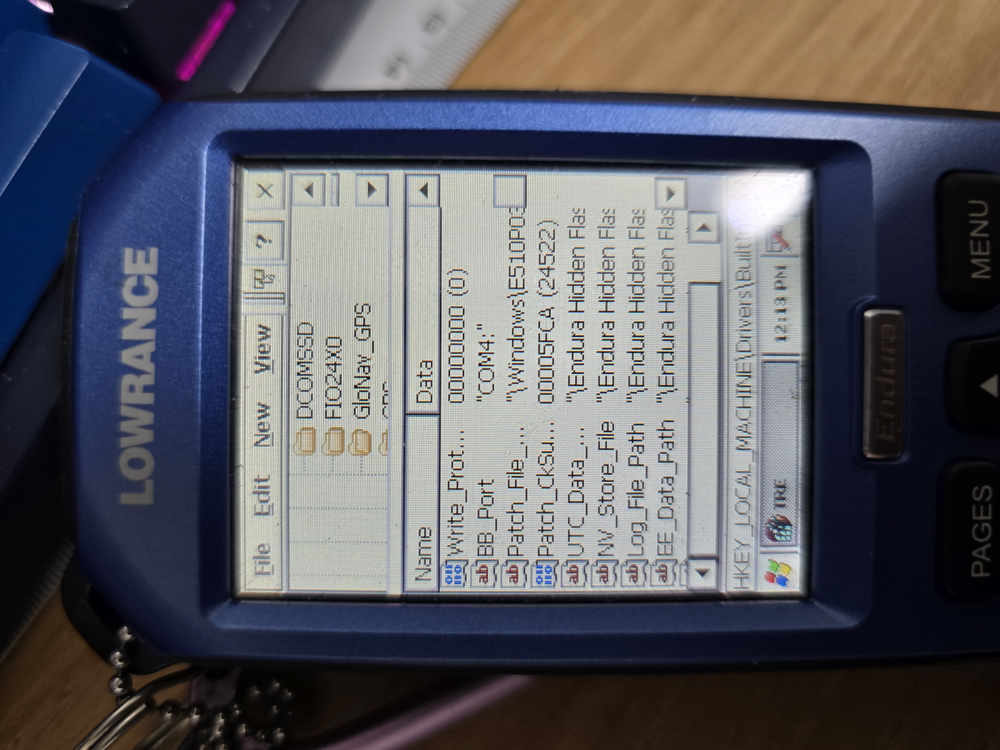

# Lowrance Endura GNS7560 GPS Reverse Engineering

## Lowrance Endura 핸드헬드 GPS와 GNS7560 설정 실험 기록: 한국어 설명

이 레포지토리는 Lowrance Endura 핸드헬드 GPS 기기를 분해·수리하고,  
내부에서 숨겨져 있던 Windows CE 환경과 GNS7560 GPS 칩셋 설정을 파고들며 정리한 **리버스 엔지니어링 / 실험 노트**입니다.

- 터치스크린이 고장난 중고 Endura 유닛을 직접 분해 및 수리
- SD 카드 기반 “펌웨어 업데이트” 메커니즘을 이용해 **OziExplorer 및 Windows CE 쉘 실행**
- Windows CE용 시리얼 터미널로 내부 GPS 모듈에 직접 접속
- 부팅 시마다 반복적으로 출력되는 `2006 Glonav Inc. GNS7560` 배너 관찰
- Windows CE 레지스트리와 공개 헤더 파일(`GN_GPS_api.h`)를 매칭하여 **GNS7560 설정값 분석**
- 레지스트리 값을 수정해 **GPS 출력 정밀도와 업데이트 주기를 2 Hz까지 향상** (그 이상은 불안정)

자세한 내용은 아래 영어 설명과 개별 문서에서 다룹니다.

한국어 문서는 README_KR.md를 참조하십시오.

---

## Background & Motivation

I’ve always liked devices that pretend to be “closed”, but are actually just… lazy about hiding their internals.

The Lowrance Endura handheld GPS is one of those.  
Lowrance is well known in the marine world for their fish finders and chart plotters, but not so much for hiking or automotive GPS units like Garmin.

And somehow... I loved GPS devices ever since I was a kid. Its clearly a fascinating things to even just look at it... 
Think about it. You have a portable device which have a small chip integrated in it, and you can know every information about your location? 

I started to ride motorcycle from 2023. I needed a device that can do everything, like displaying lots of data fields and store it inside a device as a form of a log file... but in a faster GPS refresh rate. Garmin didn't fit into my budget, and is quite limited since GPS refresh rate is fixed into 1Hz. 

At some point I heard a rumor:

> “These Endura units are actually running Windows CE inside.”

That was enough.  
I impulsively bought **two used units**, one of which had a dead touchscreen, just to see how far I could go with it.

This repository is a logbook of that journey:
from bringing a broken device back to life, to booting into an ugly Windows CE shell, and finally tweaking the internal **GNS7560 GPS receiver** through driver settings buried in the registry.

---

## Device teardown & touchscreen resurrection

One of the Endura units had a very simple but fatal symptom:

- The device would power on
- The LCD would show the usual UI
- But **the touchscreen simply did not respond**

After opening the unit, I traced the touchscreen connection and found:

- A **4-pin resistive touch panel cable** going to the main board
- A very suspicious looking solder joint / connector area

I strongly suspected a cracked or poorly soldered connection on this 4-wire resistive touch interface.

And there it was!

So:

- Reflowed and re-soldered the connector
- Reassembled the device
- Booted again

Result: the touchscreen came back to life.  
So now I had:

- One “reference” unit  
- One “repaired & hackable” unit

…which was perfect.

---

## Hijacking the boot flow: from Endura app to OziExplorer

The Endura firmware has an interesting behavior:

- On boot, if there is an SD card inserted
- And if a certain executable file exists with a specific name on that card
- The device will **run that executable instead of the stock Endura application**

This is clearly meant for “firmware update” style utilities, but it can also be used as a **launcher bypass**.

There exists a third-party navigation software for Windows CE called **OziExplorer**.  
By placing OziExplorer on the SD card with the expected update executable name, I could:

1. Boot the unit
2. Have it run OziExplorer instead of the default Lowrance UI
3. Use OziExplorer’s own configuration tools to create a shortcut that launches:

Once explorer.exe was started, the familiar and gloriously ugly Windows CE shell appeared.
So yes:

The Endura is basically a Windows CE handheld with a custom shell on top.

## Talking to the GPS module

With the CE shell available, I installed a serial terminal for Windows CE and started poking around for interesting COM ports.
It turned out COM3 is the dedicated COM Port for GPS, and Lowrance app would have hardcoded COM Port inside it. 

On the suspected GPS port, something instantly stood out.
Every time I opened a serial session, I would see:

**2006 Glonav Inc. GNS7560 All rights reserved.**

…followed by a stream of standard NMEA sentences.

This happened not only on a cold boot, but:

- Every time I closed the serial session and reopened it
- The same “Glonav” banner appeared again

At first glance, this felt wrong:
- If I was wired into a simple hardware UART directly on the GPS module,
- I would not expect the “boot banner” to reappear just because I reopened my terminal.

Something else had to be in the middle.

## “Wait, why does the boot message keep repeating?”

I already knew that some GPS modules print a startup banner once during power-on.
But this behavior was different:

- Close serial port → reopen → banner appears again
- Repeat → banner again

This strongly suggested that I wasn’t talking to the bare metal UART on the chip, but to some software layer that reset or proxied the connection whenever the port was opened.

Digging through old forum posts (including communities that hack early Android and Windows CE car navigation units), I found stories that:

- The Glonav GNS7560 was commonly used behind a software UART driver
- That driver lived deep inside the OS, not just on a simple GPIO + UART line

If that is true, then on Windows CE:

The configuration of that GPS “driver” must live somewhere in the OS…
and on CE, “somewhere” usually means the registry.

Some versions of Windows CE does not include regedit, but one can easily download Windows CE regedit online.
Somehow I got an ARM compatible version of Windows CE Regedit and boom! there it is. 

## Hunting the driver in the Windows CE registry

On Windows CE, many built-in device drivers are registered under:

**HKEY_LOCAL_MACHINE\Drivers\BuiltIn**

So I started digging through the registry, looking for anything that smelled like GPS or Glonav.

Eventually I found a key that matched what I was hoping for:

**HKEY_LOCAL_MACHINE\Drivers\BuiltIn\Glonav-GPS**

Under this key were multiple values that looked very familiar.

While searching for GNS7560 online, I had found one of the very few public references to this chip:

- A header file: GN_GPS_api.h
- Coming from an Android device repository that used the same GNS7560 GPS receiver

https://github.com/Nu3001/hardware_rk29_gps/blob/master/gns7560/inc/GN_GPS_api.h

Many of the field names inside that header matched the registry value names inside Glonav-GPS almost one-to-one.

So the picture became clear:

- The Endura’s GPS module is a GNS7560
- It is driven by a Windows CE driver registered under Glonav-GPS
- Its runtime configuration is stored entirely in the registry

Which meant one thing:
I could start tweaking those values.

In addition, I also found out that **every internal variables** are stored as a form of system registry.
- System Versions
- System Update History
- Trip Computer, GPS Data
- Almost every variable that Lowrance Endura APP can hold 

## Tuning the GNS7560 GPS settings

By comparing:

- Registry values under Glonav-GPS
- Symbol names from GN_GPS_api.h

I could roughly infer what each parameter was supposed to control.

I then experimented with modifying:

- Reported precision / position output settings
- NMEA output update rate

Results:

- Default behavior: 1 Hz update
- After tuning: 2 Hz update rate, stable
- Going beyond 2 Hz: the module would eventually lock up or become unstable

So 2 Hz turned out to be the practical limit for this specific hardware + firmware combination, at least without rewriting the whole driver or touching the board.

Still, forcing 2 Hz update from a sealed consumer device through nothing but the registry and a third-party serial terminal felt pretty rewarding.

## Thoughts on how Oziexplorer Handles NMEA Stream

When GPS Refresh rate is set to 2Hz, Every data field of Oziexplorer started to update at 2Hz rate. 
Including time, Date, Barometric pressure and Temperature, which is irrelevant to GPS, and gathered not from GPS but different sensor with different protocols.

So I can think a simple hypothesis about how Oziexplorer software handles the NMEA stream:

- An NMEA Stream is also a data refresh command. Every time new NMEA Stream is arrived, it will try to refresh every possible data field from the deivce.
- Without NMEA Data stream, No data is refreshed. However, Non-GPS related data fields will start to update at 1Hz when user intentionally disable GPS by app configuration.

## What this repository is (and isn’t) 

This repo is not:

- A complete custom firmware
- A ready-made “install this and everything works” kit
- A cracking tool or patch for proprietary software

Instead, it is more like a lab notebook that includes:

Notes on disassembling and repairing a broken Endura touchscreen unit

Step-by-step description of how to:

- Hijack the SD card update mechanism
- Launch OziExplorer instead of the stock shell
- Elevate into explorer.exe and the full Windows CE environment

Think of it as a reference for:

“How far can you push a random old Windows CE GPS device,
without touching the firmware image or writing a single line of code on the device itself?”

**This project is for educational, Experimental, and some fun purposes only**

Again, I do not endorse any of these behaviors:
- Circumventing licencing, some paid map files, or any online services.
- Using my technique on devices that you do NOT own.

However, what I **do** encourage is:
- Looking at the sealed device and asking how it works
- Modifying the device for personal use
- Having fun

In the future, I hope I have time to do following projects:
- Dumping the full Windows CE image and locating the actual Glonav-GPS driver binary
- Building a custom CE app that Talks to the GNS7560 directly
- Provides a minimal GPS dashboard without the stock UI
- Comparing Endura’s GPS performance against modern handheld units, using identical tracks
- Trying different GNS7560 configurations from GN_GPS_api.h and observing stability limits

This is NOT a polished project, but a documented curiosity journey into an old piece of hardware that still had a lot to show. 
